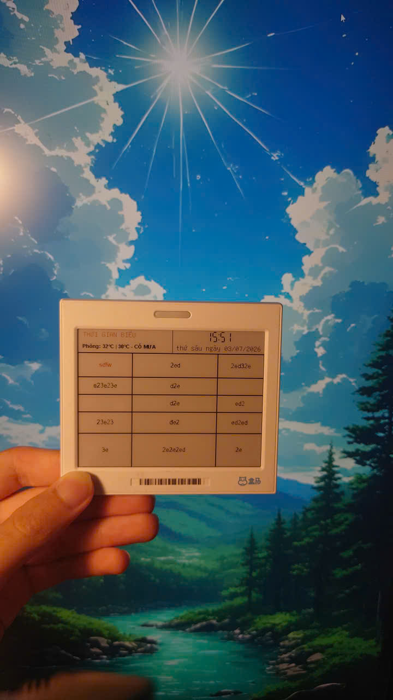
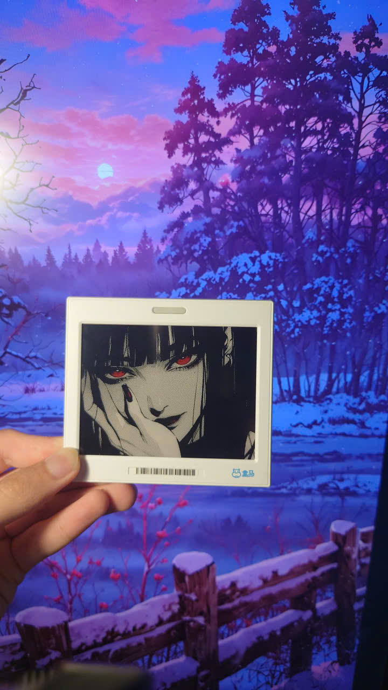
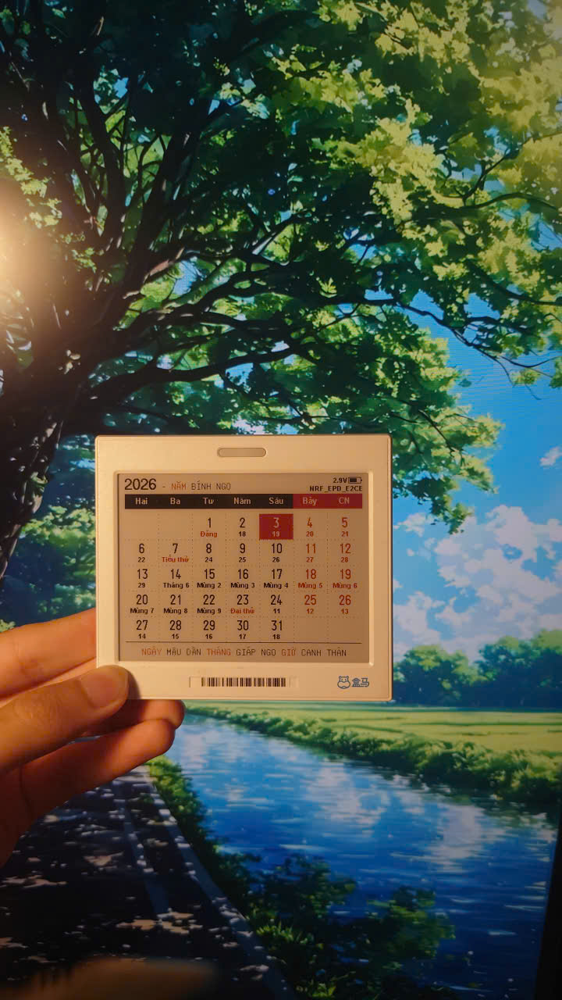
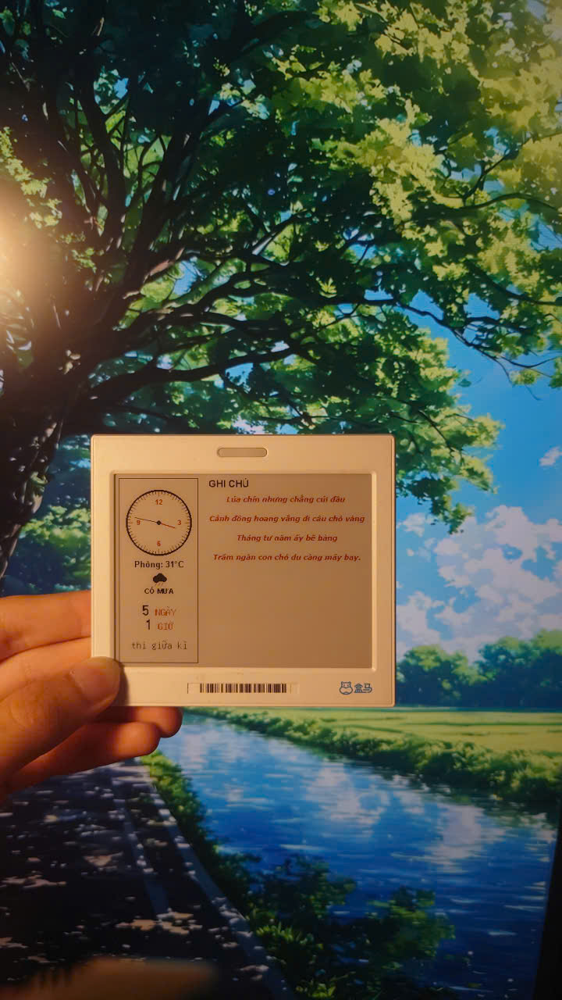
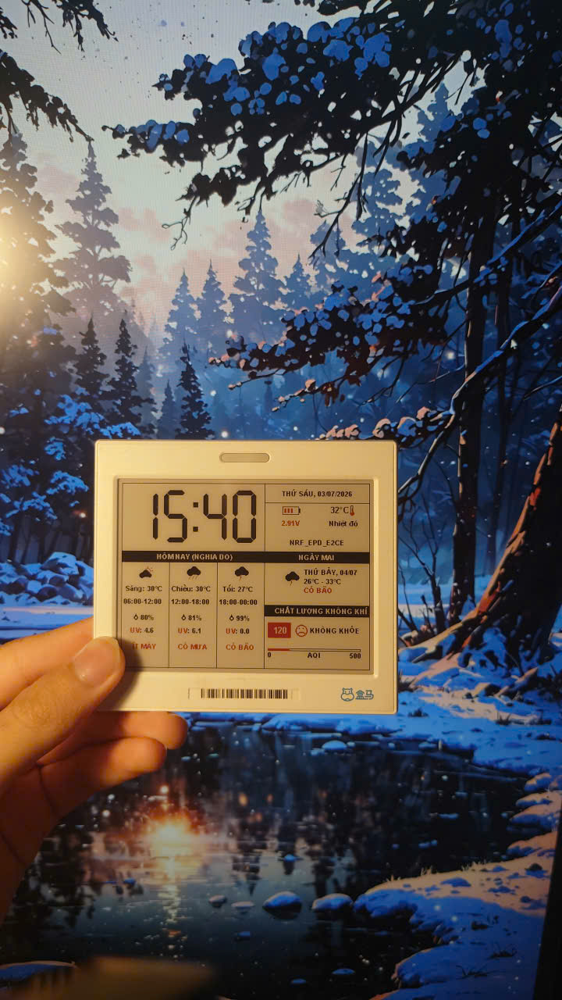

# EPD-nRF5 — E-Paper Calendar & Photo Frame

> E-paper display calendar firmware with support for Chinese lunar calendar, solar terms, and holiday schedules. It can also transmit images via Bluetooth to the e-paper display for use as a digital photo frame.

The calendar interface is adapted for common **4.2-inch** and **7.5-inch** e-paper resolutions, and the same firmware can drive different screen sizes *(screen size and driver can be switched online through the web interface)*.

---

## ✨ Features

- 📅 Monthly calendar display with Chinese lunar calendar, solar terms & holidays
- 🖼️ Bluetooth image transmission — use as a digital photo frame
- 🌐 Web-based control interface (Web Bluetooth API)
- 🔄 Online screen size & driver switching (no reflash needed)
- 💤 Sleep/wake support via NFC or wireless charger
- 📡 Bluetooth OTA firmware updates
- 🎨 Multiple image dithering algorithms
- ✍️ Doodle on images and add custom text via web UI

### Visual Gallery

Here are some examples of what the e-ink display can show:

<p align="center">
  
  
  
</p>
<p align="center">
  
  
</p>


---

## 🖥️ Supported Hardware

### MCU
| Chip | Notes |
|------|-------|
| `nrf51822` | Supported |
| `nrf51802` | Supported |
| `nrf52811` | Supported |
| `nrf52810` | Supported |

> Theoretically all electronic shelf labels (ESL) based on the above chips are supported.

### E-Paper Drivers
| Driver Series | Colors |
|--------------|--------|
| `UC81xx` | Black & White / 3-color / 4-color |
| `SSD16xx` | Black & White / 3-color / 4-color |

Custom pin mapping from the e-paper display to the MCU is supported.

---

## 🌐 Web Interface

This project includes a web-based interface built with the **Web Bluetooth API**. Use it on your phone or computer:

- 🔗 **Online**: [https://tsl0922.github.io/EPD-nRF5](https://tsl0922.github.io/EPD-nRF5)
- 💾 **Offline**: Double-click `html/index.html` locally

| Resource | Link |
|----------|------|
| 🎬 Demo Video | [Bilibili — BV1KWAVe1EKs](https://www.bilibili.com/video/BV1KWAVe1EKs) |
| 💬 Discussion Group | [QQ Group: 1033086563](https://qm.qq.com/q/SckzhfDxuu) |

The web interface supports:
- Multiple image dithering algorithms
- Doodle / draw on images
- Add custom text overlays
- Switch between **photo frame** and **calendar** mode
- Display monthly calendar, lunar dates, solar terms, holidays & work schedule adjustments

---

## 📱 Supported Devices

### Laowu 4.2-inch ESL — Black & White

| Spec | Value |
|------|-------|
| MCU | nrf51822 |
| RAM | 16K |
| ROM | 128K |
| Driver | UC8176 |
| Pin Config | `0508090A0B0C0D` |
| Wakeup Pin | `07` |

> For more device configurations, see [docs/devices.md](docs/devices.md).

---

## 🛠️ Development

See [docs/develop.md](docs/develop.md) for build instructions, toolchain setup, and flashing guide.

### Project Structure

```
E-ink-4.2inch-Calendar/
├── EPD/          # E-paper display driver source
├── GUI/          # GUI rendering layer
├── Keil/         # Keil MDK project files
├── docs/         # Documentation & images
├── html/         # Web interface (index.html)
├── tools/        # Utility tools
├── main.c        # Firmware entry point
├── main.h        # Header
├── emulator.c    # PC emulator for testing
└── Makefile      # Build system
```

---

## 🙏 Acknowledgments

This project uses or references code from the following open-source projects:

- [ZinggJM/GxEPD2](https://github.com/ZinggJM/GxEPD2)
- [waveshareteam/e-Paper](https://github.com/waveshareteam/e-Paper)
- [atc1441/ATC_TLSR_Paper](https://github.com/atc1441/ATC_TLSR_Paper)

---

## 📄 License

This project is licensed under the **GPL-3.0 License** — see the [LICENSE](LICENSE) file for details.
